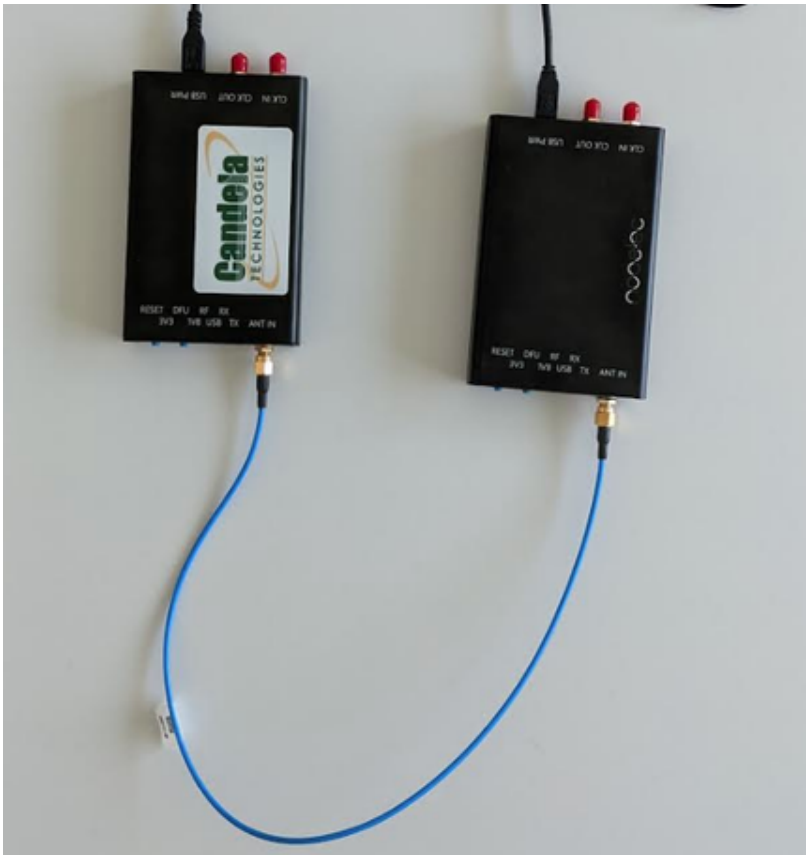

# SDR-based Jamming using GNU Radio
## Introduction
Jamming makes use of intentional radio interferences to harm wireless communications by keeping communicating medium busy, causing a transmitter to back-off whenever it senses busy wireless medium, or corrupted signal received at receivers. Jamming mostly targets attacks at the physical layer but sometimes cross-layer attacks are possible too. In this work, we implemented the following Jamming paradigms using GNU radio as follows:

### Proactive Jamming
This is a naive jamming method in which the naive jammers emit a radio signal on the wireless medium so as to disrupt the communications without paying any attention to which nodes and or channels are being jammed. We implemented the following types of jammers that jam the network proactively:

1. Constant Jammer
A constant jammer continually emits radio signals on the wireless medium. The signals can consist of a completely random sequence of bits; electromagnetic energy transmissions do not have to follow the rules of any MAC protocol. The goal of this type of jammer is twofold: (a) to pose interference on any transmitting node in order to corrupt its packets at the receiver (lower PDR) and (b) to make a legitimate transmitter (employing carrier sensing) sense the channel busy, thereby preventing it from gaining access to the channel (lower PSR). In our implementation we implemented a constant signal that jams 20MHz band centered at a center frequency F.

2. Sweeping Jammer
This type of jammer follows the same principle as the constant jammer. However, since hackrf has a maximum bandwidth of 20MHz, it cannot be used to emit jamming signal that can disrupt the whole freqeuncy spectrum of Wi-Fi. Therefore, in our implementation we implemented a sweep signal that sweeps 20MHz band centered at a center frequency F. This allows the blockage of all transmissions within 20MHz of the center frequency. The center frequency is shifted every few seconds to sweep over the whole freqeuncy spectrum of WiFi. In a 2.4GHz WiFi with 14 channels, the jammer hops from one channel to the next sequentially and continously.

3. Random Channel Hopping Jammer
This is similar to the sweeping jammer in its operation. However in this jammer, the channel to jam is chosen randomly. This random behaviour makes it harder to determine the behaviour of the jammer as compared to the sweeping jammer.

### Reactive Jamming
Reactive jammers represent a more sophisticated attack than a constant jammer. As per it’s name, a reactive jammer will sense across the target spectrum (e.g., 868MHz), before transmitting a blocking signal in response to a transmission from a nearby device. In this manner, the jamming device is able to conserve energy as a high powered radio transmission will (typically) use more power than passively receiving.

However, this process will take a few milliseconds. As such, a small amount of data will be demodulated at the receiving device before the reactive jamming signal kicks in. For example, 1B of data transmitted over a 1Mbps physical layer (PHY) has an on-air time of 8µs. Non-standard PHY and MAC implementations could therefore avoid such jamming techniques by keeping packets short (in time), combined with standard diversity techniques (frequency, space, time). In this work, we implemented the three types of jammers namely; constant, sweeping and random channel hopping to jam the network reactively.

## Implementation
To implement the aforementioned jammers we followed the following methodology

### Requirements
1. 2 Hackrf SDRs, one for transmission and the other for reception
2. [spectrum analyzer GUI for hackrf_sweep](https://github.com/pavsa/hackrf-spectrum-analyzer)
3. Linux machine

### Scripts
The following python scripts implement the aforementioned jammers:
1. jamRF_v1: This script implements both proactive and reactive jammers. Here, the waveforms that can be used to jam are; single-tone, swept-sine and Gaussian noise.
2. jamRF_v2: This script is an extension of jamRF_v1. Here, the waveforms that can be used to jam are; single-tone, QPSK-modulated and Gaussian noise. Furthermore, additional features are added to the jamming techniques. These include:
i. Energy saving feature: Allows the jammer to switch between active and sleep within one duty cycle.
ii. Memory feature: Only applies to reactive jammer to improve the jamming efficiency.

### Setup and Usage
1. Connect an SMA cable to a hackrf using the isolation chamber I/O ports.
2. Connect the SDRs to a Linux machine.
3. Startup the spectrum analyzer.
4. Set the start frequency to 2400MHz and Stop frequency to 2500MHz.
5. Open config_v1.yaml to configure the parameter settings for the jamRF_v1.py or config_v2.yaml for jamRF_v2.py.
6. On the terminal, run the jamRF_v1.py or jamRF_v2 script.

### Output
The figure below shows the output of the spectrum analyzer when Proactive sweeping jammer is running

